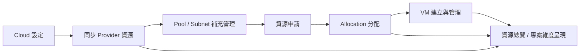

# 00 HCM 系統總覽

## 1. 功能目的

HCM Portal 是混合雲資源管理入口，用單一平台管理不同雲端來源的資源，並把各 provider 的差異包裝成 HCM 內部一致的業務概念。

HCM 的核心工作不是取代各雲端平台，而是把雲端資源整理成可被企業內部使用的資源管理流程：

1. 管理員建立 cloud provider 與 cloud connection。
2. 系統從 provider 同步資源池、網路、VM 規格來源與既有 VM。
3. 專案方以 Project / System 角度提出資源申請。
4. 管理員將申請轉成 Allocation。
5. 使用者依 Allocation 建立或管理 VM。
6. 總覽頁與專案頁呈現資源分布、使用狀態與交付結果。

## 2. 系統角色

| 角色 | 角色目的 | 主要可用功能 |
|---|---|---|
| admin | 管理整體雲端來源、資源池、網路、分配與 VM 交付 | Cloud 設定、Pool 設定、Subnet 設定、Allocation 管理、VM 管理、總覽 |
| project_manager | 管理自己負責專案的資源需求與 VM 檢視 | 資源申請、專案維度、資源總覽、VM 檢視 |
| viewer | 查看整體資源狀態，不進行異動 | 資源總覽 |
| project viewer | 查看所屬專案資源與 VM，不進行異動 | 專案維度、VM 檢視 |

角色權限以業務操作範圍區分。admin 代表平台管理者；project_manager 與 project viewer 則以被授權的 Project 作為資料範圍。

## 3. HCM 標準資源視角

HCM 以固定的業務概念包裝不同 provider 的原始資源：

| HCM 概念 | 業務意義 | Provider 可能來源 |
|---|---|---|
| Cloud Provider | 一種雲端供應商或雲端類型的定義 | AWS、VMware Cloud Director、Harvester、vSphere |
| Cloud Connection | 一組實際可連線的 provider endpoint 與授權資料 | AWS 帳號/region、VCD endpoint、Harvester cluster、vSphere inventory |
| Site | 資源所在站點或邏輯區域 | primary、dr、region、availability zone |
| Pool | 可分配給專案或系統的資源池 | VDC、Cluster、VPC/Zone、Namespace/Cluster |
| Subnet | 可供 VM 使用的網路或網段 | VPC Subnet、Org VDC Network、Portgroup、NAD |
| Security Group | VM 網路安全規則集合 | AWS Security Group、provider 等價安全資源 |
| Project | 業務專案或服務群組 | 企業內部專案代碼 |
| System | Project 底下的系統或應用 | AP、DB、Batch、Gateway 等系統 |
| Allocation | Project/System 被核准可使用的資源額度或指定資源 | shared quota、dedicated assignment |
| VM | 實際交付或同步進 HCM 的虛擬機 | EC2 instance、VCD VM、Harvester VM、vSphere VM |

## 4. 主業務流程

### 4.1 雲端資源納管

| 步驟 | 使用者目的 | 產出資料 |
|---|---|---|
| 建立 Provider | 定義雲端類型、站點、資源與 VM 表單規則 | Provider 定義 |
| 建立 Connection | 設定實際雲端 endpoint 與授權資訊 | Cloud Connection |
| 同步資源池 | 取得 provider 可管理資源範圍與容量 | Pool |
| 同步網路 | 取得 VM 可使用的網路與安全資源 | Subnet、Security Group |
| 同步 VM 規格來源 | 取得建立 VM 可用的 template、image、flavor | VM Catalog |
| 同步 VM 清單 | 將 provider 現有 VM 帶入 HCM | VM |

### 4.2 專案資源申請

| 步驟 | 使用者目的 | 產出資料 |
|---|---|---|
| 選擇或建立 Project | 指定資源需求所屬專案 | Project |
| 選擇或建立 System | 指定需求所屬系統 | System |
| 選擇資源需求 | 指定 shared / dedicated 資源池與估算需求 | 申請內容 |
| 送出申請 | 將需求交給平台管理員處理 | Allocation Request、Apply History |

### 4.3 資源分配

| 步驟 | 使用者目的 | 產出資料 |
|---|---|---|
| 檢視待處理申請 | 確認 Project/System 需要哪些資源 | Pending Request |
| 建立 shared allocation | 給 Project/System 一段可使用 quota | Allocation |
| 建立 dedicated assignment | 指派專屬 pool 給 Project/System | Dedicated Allocation |
| 完成申請 | 將申請轉成可用額度並關閉待辦 | Completed Request |

### 4.4 VM 交付與管理

| 步驟 | 使用者目的 | 產出資料 |
|---|---|---|
| 選擇 Pool / Allocation | 確認 VM 可建立在哪個資源範圍 | VM 建立條件 |
| 填寫 VM 規格 | 依 provider 能力選擇 template、image、flavor、網路與安全設定 | VM 建立需求 |
| 建立 VM | 在 provider 建立 VM 或記錄 HCM VM | VM |
| 操作 VM 狀態 | 啟動、停止或追蹤 VM 狀態 | VM 狀態 |

## 5. 功能地圖

| 功能 | 業務目的 | 主要資料 | Provider 影響 |
|---|---|---|---|
| Resource Overview | 從 Cloud / Site / Pool 角度看整體資源 | Pool、VM、Allocation | 使用已同步資料，通常不直接進 provider |
| Project Dimension | 從 Project / System 角度看資源與 VM | Project、System、Allocation、VM | 使用已同步資料，通常不直接進 provider |
| Cloud Settings | 管理 provider、connection 與初始化同步 | Provider、Connection、Pool、Subnet、VM Catalog、VM | 授權與同步進 provider plugin |
| Pool Settings | 補充與維護資源池設定 | Pool、Subnet | 通常使用 HCM 本地資料 |
| Subnet Settings | 補充與維護網路設定 | Subnet、Pool | 通常使用 HCM 本地資料 |
| Apply Wizard | 專案方提出資源需求 | Project、System、Allocation Request | 不直接進 provider |
| Allocation Management | 將申請轉成可用配置 | Allocation Request、Allocation、Pool | Harvester 等 provider 可能有附加資源 |
| VM Management | 建立與管理 VM | VM、Pool、Allocation、Subnet、Security Group | 建立、啟停、狀態追蹤進 provider plugin |
| User and Role | 管理使用者與可見資料範圍 | User、Project | 不直接進 provider |

## 6. Provider Plugin 在系統中的位置

HCM 不把不同 provider 的差異寫死在功能主流程中，而是透過 provider plugin 模型處理差異。

功能文件只描述「此業務節點需要 provider 能力」；provider plugin 文件負責描述該 provider 如何提供該能力、API 上下行、欄位轉換與畫面差異。

| 業務節點 | 為什麼需要 plugin | 例子 |
|---|---|---|
| Provider 授權 | 不同 provider 授權模式不同 | access key、token、service account |
| 同步資源 | 不同 provider 的 pool、network、VM 概念不同 | VCD VDC、AWS VPC/Subnet、vSphere Cluster |
| VM 建立 | 不同 provider 的 VM 建立欄位與能力不同 | AMI / flavor、template、namespace |
| VM 操作 | 不同 provider 支援的開關機與狀態不同 | start、stop、poll status |
| Allocation 附加資源 | 部分 provider 需在分配時建立附屬資源 | Harvester namespace |

## 7. 全系統資料流向

| 來源功能 | 產出資料 | 後續使用功能 |
|---|---|---|
| Cloud Settings | Provider、Connection、Pool、Subnet、Security Group、VM Catalog、VM | Overview、Pool Settings、Subnet Settings、Apply Wizard、VM Management |
| Pool Settings | 補齊後的 Pool 設定 | Overview、Apply Wizard、Allocation Management、VM Management |
| Subnet Settings | 補齊後的 Subnet 設定 | Pool Settings、VM Management |
| Apply Wizard | Allocation Request、Apply History | Allocation Management |
| Allocation Management | Allocation、Completed Request | Project Dimension、VM Management、Overview |
| VM Management | VM、VM 狀態 | Overview、Project Dimension、VM Management |
| User and Role | User、Project 可見範圍 | 全系統資料可見性 |

## 8. 待確認事項

| 項目 | 說明 |
|---|---|
| viewer / project viewer 是否正式納入本次 SDD | 舊需求提到這兩個角色，但目前主流程以 admin / project_manager 為主 |
| VM 刪除與修改的業務範圍 | 電子發票需求曾提到不支援 VM 刪除/修改，但通用 HCM 仍需確認是否保留 |
| vSphere VM 建立方式 | 舊需求提到可能透過既有 Terraform 流程，需要在 provider 文件中確認 |
| vCD 是否允許 HCM 建立 VM | 舊需求曾標註不支援，需與目前產品目標對齊 |

