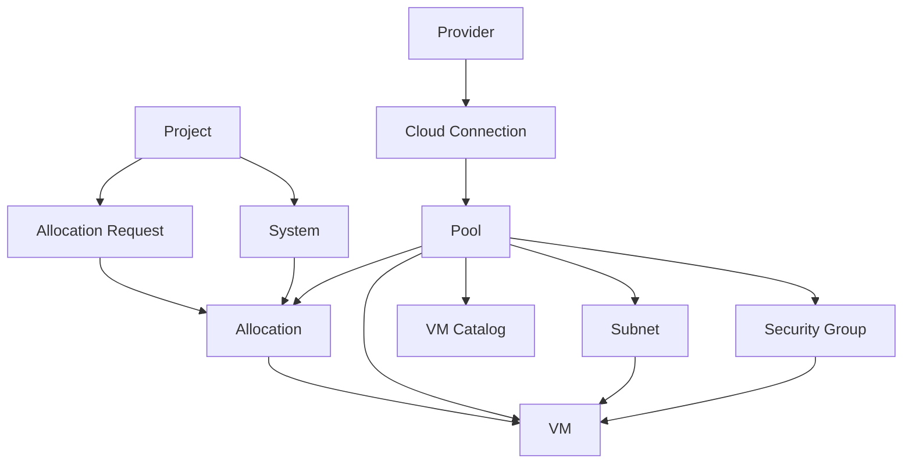

# 01 業務資料字典

## 1. 功能目的

本文件定義 HCM SDD 後續文件共同使用的業務名詞、資源單位、資料狀態與主要資料關聯。後續功能文件不重複解釋共用概念，只需引用本文件定義。

## 2. 共用名詞

| 名詞 | 定義 | 備註 |
|---|---|---|
| HCM | 混合雲資源管理入口，整合多 provider 資源並提供申請、分配與 VM 管理流程 | 本系統 |
| Provider | 雲端供應商或雲端平台類型 | 例如 AWS、VCD、Harvester、vSphere |
| Plugin | Provider 差異的業務能力封裝 | 例如同步 pool、建立 VM、開關機 |
| Cloud | HCM 內的雲端分類 | 可對應私有雲、公有雲 hicloud、公有雲 AWS |
| Connection | 實際連到 provider 的設定 | 包含 endpoint、授權資訊、同步狀態 |
| Site | 資源所在站點或邏輯區域 | 例如 primary、dr、region |
| Pool | 可分配與交付 VM 的資源池 | 可能是 VDC、Cluster、VPC 範圍等 |
| Subnet | VM 可使用的網路或網段 | 可綁定一個或多個 pool |
| Security Group | VM 網路安全規則或等價資源 | 主要受 provider 能力影響 |
| Project | 業務專案、服務群組或需求單位 | Allocation 與 VM 通常會歸屬到 Project |
| System | Project 底下的系統或應用 | 一個 Project 可有多個 System |
| Allocation | Project/System 被核准可使用的資源額度或指定資源 | shared quota 或 dedicated assignment |
| Allocation Request | 專案方送出的資源申請 | 由 admin 轉成 Allocation |
| VM | HCM 交付或同步管理的虛擬機 | 可能來自 provider 同步或 HCM 建立 |
| VM Catalog | 建立 VM 時可用的規格來源 | template、image、flavor、disk type |

## 3. 角色與資料範圍

| 角色 | 資料範圍 | 可異動資料 |
|---|---|---|
| admin | 全部 Cloud、Project、Pool、Subnet、Allocation、VM | Provider、Connection、Pool、Subnet、Allocation、VM、User |
| project_manager | 被授權 Project 相關資料 | 申請資料；VM 操作依後續功能規格定義 |
| viewer | 整體資源狀態 | 無，僅檢視 |
| project viewer | 被授權 Project 相關資料 | 無，僅檢視 |

若功能文件未特別說明，admin 代表可管理全部資料，project 類角色代表只能看見或操作其被授權 Project。

## 4. 資源單位標準

HCM 需用統一單位呈現資源，避免 provider 原生單位混用。

| 資源 | Pool 層級單位 | VM 層級單位 | 說明 |
|---|---|---|---|
| CPU | Core / vCPU | Core / vCPU | provider 若使用 MHz 或其他原生單位，需轉成 Core / vCPU |
| Memory | GB | GB | 顯示與申請皆使用 GB |
| Disk | TB | GB | Pool 容量以 TB 呈現；VM 磁碟以 GB 呈現 |
| Network | CIDR / 網路名稱 | IP / NIC | provider 差異放在 plugin 文件 |

換算責任：

| 項目 | 規則 |
|---|---|
| HCM 畫面 | 只呈現 HCM 標準單位 |
| HCM 申請 | 使用者以 HCM 標準單位填寫需求 |
| Provider 同步 | provider 原始單位需轉成 HCM 標準單位後進入 HCM |
| 已申請百分比 | 使用 HCM 標準單位計算 |

## 5. 主要資料定義

### 5.1 Provider

| 欄位 | 業務意義 | 備註 |
|---|---|---|
| Provider ID | HCM 內唯一識別 | 例如 aws、hicloud、private-cloud |
| 名稱 | 畫面顯示名稱 | 例如 公有雲 AWS |
| Provider 類型 | 對應的 plugin 類型 | 例如 AWS、VCD、Harvester、vSphere |
| 是否啟用 | 是否可新增 connection 或用於後續流程 | 停用後不可新增連線 |
| Site 設定 | provider 可用站點或區域 | 供 pool 與總覽分類 |
| VM 表單規則 | 建立 VM 時欄位與規格來源 | provider 差異來源之一 |
| 網路策略 | VM 建立時 IP / Security Group 等規則 | provider 差異來源之一 |

### 5.2 Cloud Connection

| 欄位 | 業務意義 | 備註 |
|---|---|---|
| Connection ID | 實際連線識別 | 同一 provider 可有多個 connection |
| Provider | 所屬 provider | 決定使用哪個 provider plugin |
| 顯示名稱 | 管理員辨識用名稱 | 可為 cluster、region、endpoint 名稱 |
| 連線位置 | provider endpoint 或等價連線資訊 | 敏感細節不得明文展示 |
| 授權資訊 | 登入或 API 授權所需資料 | 密碼、token、secret 需遮罩 |
| 同步狀態 | 尚未同步、同步中、成功、失敗 | 功能文件描述畫面呈現 |
| 最後同步時間 | 最後一次同步完成時間 | 用於管理員判斷資料新鮮度 |
| 同步範圍 | 可選的 pool / namespace / region 範圍 | 依 provider 能力決定 |

### 5.3 Pool

| 欄位 | 業務意義 | 備註 |
|---|---|---|
| Pool ID | HCM 內資源池識別 | 可由同步或人工建立 |
| 名稱 | 畫面顯示名稱 | 可保留 provider 原始名稱與 HCM 顯示名稱 |
| Provider / Cloud | 所屬雲端 | 決定後續 VM 建立能力 |
| Site | 所屬站點或區域 | 用於總覽分層 |
| Pool 類型 | shared 或 dedicated | 影響申請與分配方式 |
| 環境 | Prod、UAT、SIT、DR 等 | 用於篩選與 VM 建立條件 |
| CPU 總量 | 可管理 CPU 容量 | HCM 標準單位 |
| CPU 已配置/已使用 | 已配置或 provider 回報使用量 | 指標意義由功能文件定義 |
| Memory 總量 | 可管理 Memory 容量 | GB |
| Disk 總量 | 可管理 Disk 容量 | TB |
| 可用 Subnet | Pool 可使用的網路 | 由 Subnet 關聯 |
| Provider 來源識別 | 對應 provider 原始資源 | 用於同步與 VM 操作 |

### 5.4 Subnet

| 欄位 | 業務意義 | 備註 |
|---|---|---|
| Subnet ID | HCM 內網路識別 | 可由同步或人工建立 |
| 名稱 | 畫面顯示名稱 | 可對應 provider network 名稱 |
| Provider / Cloud | 所屬雲端 | 決定網路能力 |
| CIDR | 網段 | provider 若未提供可為空或待補 |
| Gateway | 預設閘道 | provider 若未提供可為空或待補 |
| Subnet 類型 | 網路用途分類 | 例如 public、private、management，實際選項由 provider 設定 |
| 關聯 Pool | 可使用此 subnet 的 pool | 可為多個 |
| Provider 來源識別 | 對應 provider 原始 network | 用於同步與 VM 建立 |

### 5.5 Security Group

| 欄位 | 業務意義 | 備註 |
|---|---|---|
| Security Group ID | HCM 內安全群組識別 | provider 不支援時可無此資料 |
| 名稱 | 畫面顯示名稱 | 建立 VM 時可作為選項 |
| 說明 | 安全群組用途 | 供使用者辨識 |
| Scope | 套用範圍 | pool default、system managed 等 |
| Provider 來源識別 | 對應 provider 原始安全資源 | provider 文件描述轉換 |

### 5.6 Project

| 欄位 | 業務意義 | 備註 |
|---|---|---|
| Project ID | 專案代碼 | 可用於資源歸屬與標籤 |
| 名稱 | 專案名稱 | 畫面顯示 |
| Owner | 專案負責人 | 申請與權限參考 |
| 部門 | 所屬部門 | 選填 |
| 可見使用者 | 可查看或管理此專案的人 | 由角色權限決定 |

### 5.7 System

| 欄位 | 業務意義 | 備註 |
|---|---|---|
| System ID | 系統識別 | 隸屬於 Project |
| Project ID | 所屬 Project | 必填 |
| 系統代碼 | 系統簡碼 | 可用於 namespace、tag 或 VM 命名 |
| 系統名稱 | 畫面顯示名稱 | 必填 |
| 環境 | 系統使用環境 | Prod、UAT、SIT、DR 等 |

### 5.8 Allocation Request

| 欄位 | 業務意義 | 備註 |
|---|---|---|
| Request ID | 申請單識別 | 送出申請後產生 |
| Project | 申請所屬專案 | 可對應 Project ID |
| Applicant | 申請人 | 送出申請的使用者 |
| 建立日期 | 申請建立時間 | 用於申請歷程 |
| 狀態 | pending、completed 等 | 功能文件定義狀態呈現 |
| System 清單 | 此申請涉及哪些系統 | 每個 system 可有不同資源需求 |
| Mount / Pool 需求 | dedicated 或 shared pool 需求 | 由 Apply Wizard 產生 |

### 5.9 Allocation

| 欄位 | 業務意義 | 備註 |
|---|---|---|
| Allocation ID | 分配識別 | 由管理員建立 |
| Project ID | 分配給哪個 Project | 必填 |
| System ID | 分配給哪個 System | 可依流程決定是否必填 |
| Pool ID | 使用哪個資源池 | 必填 |
| Allocation 類型 | shared quota 或 dedicated assignment | 影響 VM 可建立方式 |
| CPU Quota | 可使用 CPU 額度 | HCM 標準單位 |
| Memory Quota | 可使用 Memory 額度 | GB |
| Disk Quota | 可使用 Disk 額度 | TB |
| 可用 Subnet | 此 allocation 可用網路 | 供 VM 建立 |
| Namespace | provider 端附屬隔離資源 | Harvester 等 provider 可能使用 |
| Namespace 狀態 | 附屬資源是否完成 | 僅 provider 需要時呈現 |

### 5.10 VM

| 欄位 | 業務意義 | 備註 |
|---|---|---|
| VM ID | HCM 內 VM 識別 | 可由 HCM 建立或 provider 同步 |
| 名稱 | VM 名稱 | 畫面顯示 |
| Hostname | 主機名稱 | 建立 VM 時常用 |
| Provider / Pool | VM 所屬 provider 與資源池 | 決定後續操作能力 |
| Allocation | VM 使用哪個 allocation | 可為空，視同步來源而定 |
| 狀態 | provisioning、running、stopped 等 | 由 provider 狀態轉換 |
| CPU | VM 規格 CPU | Core / vCPU |
| Memory | VM 規格 Memory | GB |
| Disk | VM 磁碟 | GB |
| IP | 主要 IP | 可由 provider 回報或使用者指定 |
| NIC | 網卡設定 | 多 NIC 支援依 provider 而定 |
| Security Group | VM 使用的安全群組 | provider 支援時才有 |
| Provider 來源識別 | provider 原始 VM ID | 開關機、追蹤狀態時使用 |
| Tags | Project、System、Env、Namespace 等標記 | 用於歸屬與篩選 |

## 6. 標準狀態

### 6.1 VM 狀態

| 狀態 | 業務意義 |
|---|---|
| provisioning | VM 建立中或 provider 尚未完成交付 |
| starting | VM 啟動中 |
| running | VM 執行中 |
| stopping | VM 停止中 |
| stopped | VM 已停止 |
| error | VM 或 provider 回報異常 |

### 6.2 同步狀態

| 狀態 | 業務意義 |
|---|---|
| idle | 尚未同步或目前未執行同步 |
| syncing | 正在同步 provider 資料 |
| ok | 最近一次同步成功 |
| error | 最近一次同步失敗 |

### 6.3 申請狀態

| 狀態 | 業務意義 |
|---|---|
| pending | 申請已送出，等待管理員處理 |
| completed | 申請已轉成 allocation 或已由管理員完成 |
| done | 申請歷程中表示已完成的顯示狀態 |

## 7. 主要資料關聯

## 8. 待確認事項

| 項目 | 說明 |
|---|---|
| Pool 容量指標的百分比定義 | 需在 Resource Overview 文件中明確區分已配置、已使用、已申請 |
| Security Group 在非 AWS provider 的標準化程度 | 需由各 provider 文件說明 |
| VM 修改與刪除是否納入本次業務範圍 | 舊需求有不支援描述，需與產品目標確認 |
| viewer / project viewer 權限是否正式開放 | 若正式納入，需在 User and Role 文件補完整權限表 |

