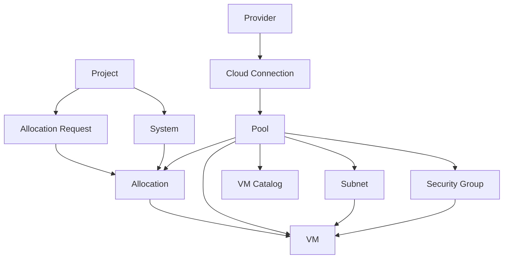

# 01 業務資料字典

## 1. 功能目的

本文件定義 HCM SDD 後續文件共同使用的業務名詞、資源單位、資料狀態與主要資料關聯。後續功能文件不重複解釋共用概念，只需引用本文件定義。

## 2. 共用名詞

| 名詞 | 定義 | 備註 |
|---|---|---|
| HCM | 混合雲資源管理入口，整合多 provider 資源並提供申請、分配與 VM 管理流程 | 本系統 |
| Provider | 雲端供應商或雲端平台類型 | 例如 AWS、VCD、Harvester、vSphere |
| Plugin | Provider 差異的業務能力封裝 | 例如同步 pool、建立 VM、開關機 |
| Cloud | HCM 內的雲端分類 | 可對應私有雲、公有雲 hicloud、公有雲 AWS |
| Connection | 實際連到 provider 的設定 | 包含 endpoint、授權資訊、同步狀態 |
| Site | 資源所在站點或邏輯區域 | 例如 primary、dr、region |
| Pool | 可分配與交付 VM 的資源池 | 可能是 VDC、Cluster、VPC 範圍等 |
| Subnet | VM 可使用的網路或網段 | 可綁定一個或多個 pool |
| Security Group | VM 網路安全規則或等價資源 | 主要受 provider 能力影響 |
| Project | 業務專案、服務群組或需求單位 | Allocation 與 VM 通常會歸屬到 Project |
| System | Project 底下的系統或應用 | 一個 Project 可有多個 System |
| Allocation | Project/System 被核准可使用的資源額度或指定資源 | shared quota 或 dedicated assignment |
| Allocation Request | 專案方送出的資源申請 | 由 admin 轉成 Allocation |
| VM | HCM 交付或同步管理的虛擬機 | 可能來自 provider 同步或 HCM 建立 |
| VM Catalog | 建立 VM 時可用的規格來源 | template、image、flavor、disk type |

## 3. 角色與資料範圍

| 角色 | 資料範圍 | 可異動資料 |
|---|---|---|
| admin | 全部 Cloud、Project、Pool、Subnet、Allocation、VM | Provider、Connection、Pool、Subnet、Allocation、VM、User |
| project_manager | 被授權 Project 相關資料 | 申請資料；VM 操作依後續功能規格定義 |
| viewer | 整體資源狀態 | 無，僅檢視 |
| project viewer | 被授權 Project 相關資料 | 無，僅檢視 |

若功能文件未特別說明，admin 代表可管理全部資料，project 類角色代表只能看見或操作其被授權 Project。

## 4. 資源單位標準

HCM 需用統一單位呈現資源，避免 provider 原生單位混用。為了確保儲存精確度與計算一致性，系統採「持久層基礎單位」與「呈現層業務單位」分離策略。

| 資源 | 持久層基礎單位 (Database) | 呈現層業務單位 (UI) | 說明 |
|---|---|---|---|
| CPU | **Millicores** | **Core** | 資料庫與 API 傳輸原始 Millicores；畫面由前端換算為 Core |
| Memory | **Bytes** | **GB / GiB** | 資料庫與 API 傳輸原始 Bytes；畫面由前端依需求換算 |
| Disk | **Bytes** | **TB / GB** | 資料庫與 API 傳輸原始 Bytes；畫面由前端換算 |
| Network | CIDR / 網路名稱 | IP / NIC | provider 差異放在 plugin 文件 |

換算責任：

| 項目 | 規則 |
|---|---|
| HCM 畫面 | 負責將原始單位轉為業務單位，支援單位切換 (GB/GiB) |
| HCM 申請 | 使用者填寫業務單位，前端需轉為 **Millicores** 或 **Bytes** 後送出 |
| Provider 同步 | provider 原始單位需轉成 **Millicores** 或 **Bytes** 後存入 HCM 資料庫 |
| API 回傳 | **不進行換算**，直接回傳資料庫中的原始 Millicores 或 Bytes |
| 已申請百分比 | 前端使用原始單位計算以確保精確度 |

## 5. 主要資料定義

### 5.1 Provider

| 欄位 | 業務意義 | 備註 |
|---|---|---|
| Provider ID | HCM 內唯一識別 | 例如 aws、hicloud、private-cloud |
| 名稱 | 畫面顯示名稱 | 例如 公有雲 AWS |
| Provider 類型 | 對應的 plugin 類型 | 例如 AWS、VCD、Harvester、vSphere |
| 是否啟用 | 是否可新增 connection 或用於後續流程 | 停用後不可新增連線 |
| Site 設定 | provider 可用站點或區域 | 供 pool 與總覽分類 |
| VM 表單規則 | 建立 VM 時欄位與規格來源 | provider 差異來源之一 |
| 網路策略 | VM 建立時 IP / Security Group 等規則 | provider 差異來源之一 |

### 5.2 Cloud Connection

| 欄位 | 業務意義 | 備註 |
|---|---|---|
| Connection ID | 實際連線識別 | 同一 provider 可有多個 connection |
| Provider | 所屬 provider | 決定使用哪個 provider plugin |
| 顯示名稱 | 管理員辨識用名稱 | 可為 cluster、region、endpoint 名稱 |
| 連線位置 | provider endpoint 或等價連線資訊 | 敏感細節不得明文展示 |
| 授權資訊 | 登入或 API 授權所需資料 | 密碼、token、secret 需遮罩 |
| 同步狀態 | 尚未同步、同步中、成功、失敗 | 功能文件描述畫面呈現 |
| 最後同步時間 | 最後一次同步完成時間 | 用於管理員判斷資料新鮮度 |
| 同步範圍 | 可選的 pool / namespace / region 範圍 | 依 provider 能力決定 |

### 5.3 Pool

| 欄位 | 業務意義 | 備註 |
|---|---|---|
| Pool ID | HCM 內資源池識別 | 可由同步或人工建立 |
| 名稱 | 畫面顯示名稱 | 可保留 provider 原始名稱與 HCM 顯示名稱 |
| Provider / Cloud | 所屬雲端 | 決定後續 VM 建立能力 |
| Site | 所屬站點或區域 | 用於總覽分層 |
| Pool 類型 | shared 或 dedicated | 影響申請與分配方式 |
| 環境 | Prod、UAT、SIT、DR 等 | 用於篩選與 VM 建立條件 |
| CPU 總量 | 可管理 CPU 容量 | HCM 標準單位 |
| CPU 已配置/已使用 | 已配置或 provider 回報使用量 | 指標意義由功能文件定義 |
| Memory 總量 | 可管理 Memory 容量 | GB |
| Disk 總量 | 可管理 Disk 容量 | TB |
| 可用 Subnet | Pool 可使用的網路 | 由 Subnet 關聯 |
| Provider 來源識別 | 對應 provider 原始資源 | 用於同步與 VM 操作 |

### 5.4 Subnet

| 欄位 | 業務意義 | 備註 |
|---|---|---|
| Subnet ID | HCM 內網路識別 | 可由同步或人工建立 |
| 名稱 | 畫面顯示名稱 | 可對應 provider network 名稱 |
| Provider / Cloud | 所屬雲端 | 決定網路能力 |
| CIDR | 網段 | provider 若未提供可為空或待補 |
| Gateway | 預設閘道 | provider 若未提供可為空或待補 |
| Subnet 類型 | 網路用途分類 | 例如 public、private、management，實際選項由 provider 設定 |
| 關聯 Pool | 可使用此 subnet 的 pool | 可為多個 |
| Provider 來源識別 | 對應 provider 原始 network | 用於同步與 VM 建立 |

### 5.5 Security Group

| 欄位 | 業務意義 | 備註 |
|---|---|---|
| Security Group ID | HCM 內安全群組識別 | provider 不支援時可無此資料 |
| 名稱 | 畫面顯示名稱 | 建立 VM 時可作為選項 |
| 說明 | 安全群組用途 | 供使用者辨識 |
| Scope | 套用範圍 | pool default、system managed 等 |
| Provider 來源識別 | 對應 provider 原始安全資源 | provider 文件描述轉換 |

### 5.6 Project

| 欄位 | 業務意義 | 備註 |
|---|---|---|
| Project ID | 專案代碼 | 可用於資源歸屬與標籤 |
| 名稱 | 專案名稱 | 畫面顯示 |
| Owner | 專案負責人 | 申請與權限參考 |
| 部門 | 所屬部門 | 選填 |
| 可見使用者 | 可查看或管理此專案的人 | 由角色權限決定 |

### 5.7 System

| 欄位 | 業務意義 | 備註 |
|---|---|---|
| System ID | 系統識別 | 隸屬於 Project |
| Project ID | 所屬 Project | 必填 |
| 系統代碼 | 系統簡碼 | 可用於 namespace、tag 或 VM 命名 |
| 系統名稱 | 畫面顯示名稱 | 必填 |
| 環境 | 系統使用環境 | Prod、UAT、SIT、DR 等 |

### 5.8 Allocation Request

| 欄位 | 業務意義 | 備註 |
|---|---|---|
| Request ID | 申請單識別 | 送出申請後產生 |
| Project | 申請所屬專案 | 可對應 Project ID |
| Applicant | 申請人 | 送出申請的使用者 |
| 建立日期 | 申請建立時間 | 用於申請歷程 |
| 狀態 | pending、completed 等 | 功能文件定義狀態呈現 |
| System 清單 | 此申請涉及哪些系統 | 每個 system 可有不同資源需求 |
| Mount / Pool 需求 | dedicated 或 shared pool 需求 | 由 Apply Wizard 產生 |

### 5.9 Allocation

| 欄位 | 業務意義 | 備註 |
|---|---|---|
| Allocation ID | 分配識別 | 由管理員建立 |
| Project ID | 分配給哪個 Project | 必填 |
| System ID | 分配給哪個 System | 可依流程決定是否必填 |
| Pool ID | 使用哪個資源池 | 必填 |
| Allocation 類型 | shared quota 或 dedicated assignment | 影響 VM 可建立方式 |
| CPU Quota | 可使用 CPU 額度 | HCM 標準單位 |
| Memory Quota | 可使用 Memory 額度 | GB |
| Disk Quota | 可使用 Disk 額度 | TB |
| 可用 Subnet | 此 allocation 可用網路 | 供 VM 建立 |
| Namespace | provider 端附屬隔離資源 | Harvester 等 provider 可能使用 |
| Namespace 狀態 | 附屬資源是否完成 | 僅 provider 需要時呈現 |

### 5.10 VM

| 欄位 | 業務意義 | 備註 |
|---|---|---|
| VM ID | HCM 內 VM 識別 | 可由 HCM 建立或 provider 同步 |
| 名稱 | VM 名稱 | 畫面顯示 |
| Hostname | 主機名稱 | 建立 VM 時常用 |
| Provider / Pool | VM 所屬 provider 與資源池 | 決定後續操作能力 |
| Allocation | VM 使用哪個 allocation | 可為空，視同步來源而定 |
| 狀態 | provisioning、running、stopped 等 | 由 provider 狀態轉換 |
| CPU | VM 規格 CPU | Core / vCPU |
| Memory | VM 規格 Memory | GB |
| Disk | VM 磁碟 | GB |
| IP | 主要 IP | 可由 provider 回報或使用者指定 |
| NIC | 網卡設定 | 多 NIC 支援依 provider 而定 |
| Security Group | VM 使用的安全群組 | provider 支援時才有 |
| Provider 來源識別 | provider 原始 VM ID | 開關機、追蹤狀態時使用 |
| Tags | Project、System、Env、Namespace 等標記 | 用於歸屬與篩選 |

## 6. 邏輯資料模型與儲存實作定位

本章定義 HCM 的邏輯資料模型，供正式開發時轉換為 production database schema、API DTO、前後端型別與測試資料。邏輯資料模型描述的是業務物件、欄位、關聯、狀態與生命週期，不綁定特定資料庫產品。

### 6.1 目前參考實作

目前 demo / reference implementation 使用 SQLite document store 保存資料：

| 項目 | 目前實作 |
|---|---|
| Database | SQLite |
| Table | `documents` |
| Primary Key | `collection` + `id` |
| Payload | `json` |
| Metadata | `created_at`、`updated_at` |

此儲存方式用於 demo、快速驗證與本機部署，不代表正式產品資料庫 physical schema。正式開發可依部署架構、交易一致性、查詢效能、稽核與維運需求，將本文件定義的邏輯資料模型轉換為 PostgreSQL、MySQL、document database 或其他持久化設計。

SDD 與後續開發應以本章邏輯資料模型為準；SQLite document store 僅作為目前原始碼行為與資料範例的參考。

### 6.2 邏輯物件與目前 collection 對應

| 邏輯物件 | 目前 collection | 說明 |
|---|---|---|
| Cloud Provider | `cloud-providers` | 雲端類型與 provider driver 設定 |
| Cloud Connection | `cloud-connections` | 實際 provider endpoint、授權與同步狀態 |
| Pool | `pools` | 可申請、分配與建立 VM 的資源池 |
| Subnet | `subnets` | VM 可使用的網路或網段 |
| Security Group | `security-groups` | provider 支援時同步或維護的安全群組 |
| Project | `projects` | 業務專案或需求單位 |
| System | `systems` | Project 底下的系統或應用 |
| Allocation | `allocations` | 已生效的 shared quota 或 dedicated assignment |
| Allocation Request | `allocation-requests` | Apply Wizard 送出的待處理申請 |
| Apply History | `apply-history` | 申請歷程顯示資料 |
| VM | `vms` | HCM 建立或 provider 同步回來的 VM |
| User | `users` | 目前 demo 使用者與角色資料 |

### 6.3 欄位命名與單位規則

| 類別 | 規則 |
|---|---|
| 欄位命名 | 目前前後端資料欄位以 snake_case 為主，例如 `pool_id`、`quota_mem_bytes`、`cpu_total_millicores` |
| ID 欄位 | 每個邏輯物件必須有 HCM 內部 `id` |
| Provider 來源識別 | provider 原始識別統一保存在 `ref.id`（及必要的 `ref.*`）欄位，供同步、開關機、狀態追蹤使用 |
| CPU | 資料庫統一使用 `_millicores` 結尾，例如 `cpu_total_millicores`；HCM 標準呈現以 Core / vCPU 表示 |
| Memory | 資料庫統一使用 `_bytes` 結尾，例如 `mem_total_bytes` |
| Disk | 資料庫統一使用 `_bytes` 結尾，例如 `disk_total_bytes` |
| 狀態欄位 | 必須使用本文件「標準狀態」章節列出的允許值，若 provider 需要額外狀態需先定義映射 |
| 敏感欄位 | password、token、secret、refresh token 等不得在查詢 response 中明文回傳 |

### 6.4 主要邏輯資料模型

以下欄位為正式開發時的邏輯 contract。實際 production schema 可拆表或正規化，但不得遺失欄位語意與關聯。

#### Cloud Provider

| 欄位 | 型別 | 必填 | 說明 |
|---|---|---|---|
| `id` | string | 是 | HCM 內部 provider ID |
| `name` | string | 是 | 顯示名稱 |
| `type` | enum | 是 | `private` 或 `public` |
| `driver` | string | 否 | 對應 provider driver，例如 `aws`、`harvester` |
| `enabled` | boolean | 否 | 是否啟用；未填時可視為啟用 |
| `sites` | array | 否 | 可用站點、region 與環境設定 |
| `subnetTypes` | array | 否 | 此 provider 可選 subnet 類型 |
| `vmFormSchema` | object | 否 | VM 建立表單規則 |
| `networkPolicy` | object | 否 | VM IP 與 Security Group 策略 |
| `vmCatalog` | object | 否 | provider 預設 VM catalog，可被 pool catalog 覆蓋 |

#### Cloud Connection

| 欄位 | 型別 | 必填 | 說明 |
|---|---|---|---|
| `id` | string | 是 | HCM connection ID |
| `cloud` | string | 是 | 所屬 Cloud Provider ID |
| `label` | string | 是 | 顯示名稱 |
| `base_url` | string | 是 | provider endpoint 或介接 API root |
| `auth` | object | 是 | 授權資料；敏感欄位查詢時需遮罩 |
| `pool_filter` | string[] | 否 | 限制同步範圍 |
| `tls_skip_verify` | boolean | 否 | 是否略過 TLS 驗證 |
| `sync_status` | enum | 是 | `idle`、`syncing`、`ok`、`error` |
| `last_synced_at` | string/null | 否 | 最後同步時間 |
| `sync_progress` | object/null | 否 | 同步中進度摘要 |

#### Pool

| 欄位 | 型別 | 必填 | 說明 |
|---|---|---|---|
| `id` | string | 是 | HCM pool ID |
| `name` | string | 是 | 顯示名稱 |
| `cloud` | string | 是 | Cloud Provider ID |
| `type` | enum | 是 | `shared` 或 `dedicated` |
| `site` | enum/string | 是 | 站點，例如 `primary`、`dr` |
| `status` | enum | 是 | `active` 或 `inactive` |
| `cpu_total_millicores` | number | 是 | CPU 總量，Millicores |
| `cpu_provisioned_millicores` | number/null | 否 | CPU 已配置量，Millicores |
| `mem_total_bytes` | number | 是 | Memory 總量，Bytes |
| `mem_provisioned_bytes` | number/null | 否 | Memory 已配置量，Bytes |
| `mem_used_bytes` | number/null | 否 | Memory 已使用量（provider 回報），Bytes |
| `disk_total_bytes` | number | 是 | Disk 總量，Bytes |
| `disk_provisioned_bytes` | number/null | 否 | Disk 已配置量，Bytes |
| `disk_used_bytes` | number/null | 否 | Disk 已使用量（provider 回報），Bytes |
| `subnet_ids` | string[] | 是 | 可用 subnet ID 清單 |
| `allowed_vm_envs` | string[] | 否 | 可建立 VM 的環境，例如 Prod、UAT |
| `default_security_group_ids` | string[] | 否 | 預設 Security Group |
| `vmCatalog` | object | 否 | 此 pool 可用 template、image、flavor、disk type |
| `ref` | object | 否 | provider 原始參照，例如 VPC、VDC、Cluster ID |
| `project_id` | string/null | 否 | dedicated pool 指派後的 project 參考，視實作策略可由 Allocation 表示 |
| `system_id` | string/null | 否 | dedicated pool 指派後的 system 參考，視實作策略可由 Allocation 表示 |

#### Subnet

| 欄位 | 型別 | 必填 | 說明 |
|---|---|---|---|
| `id` | string | 是 | HCM subnet ID |
| `name` | string | 是 | 顯示名稱 |
| `cloud` | string | 是 | Cloud Provider ID |
| `cidr` | string | 否 | CIDR，provider 未提供時可待補 |
| `gateway` | string/null | 否 | Gateway |
| `site` | enum/string | 是 | 站點 |
| `status` | enum | 是 | `active` 或 `inactive` |
| `type` | string | 是 | subnet 業務用途 |
| `pool_id` | string/null | 否 | 單一 pool 關聯，保留相容欄位 |
| `pool_ids` | string[] | 否 | 多 pool 關聯 |
| `extFields` | object | 否 | provider 或業務擴充欄位 |
| `ref` | object | 否 | provider network 原始參照 |

#### Security Group

| 欄位 | 型別 | 必填 | 說明 |
|---|---|---|---|
| `id` | string | 是 | HCM Security Group ID |
| `name` | string | 是 | 顯示名稱 |
| `cloud` | string | 是 | Cloud Provider ID |
| `pool_id` | string/null | 否 | 所屬 pool |
| `vpc_id` | string/null | 否 | AWS VPC 或 provider 等價範圍 |
| `system_id` | string/null | 否 | system-managed security group 時的 system |
| `description` | string/null | 否 | 說明 |
| `scope` | enum | 否 | `pool-default`、`system-owned`、`shared-common` |
| `ref` | object | 否 | provider 安全群組原始參照 |
| `tags` | object | 否 | provider 或 HCM 標籤 |

#### Project

| 欄位 | 型別 | 必填 | 說明 |
|---|---|---|---|
| `id` | string | 是 | Project ID |
| `code` | string | 是 | 專案代碼 |
| `name` | string | 是 | 專案名稱 |
| `owner` | string | 是 | 專案負責人 |
| `dept` | string | 否 | 部門 |

#### System

| 欄位 | 型別 | 必填 | 說明 |
|---|---|---|---|
| `id` | string | 是 | System ID |
| `project_id` | string | 是 | 所屬 Project ID |
| `code` | string | 是 | 系統代碼 |
| `name` | string | 是 | 系統名稱 |
| `envs` | string[] | 是 | 系統使用環境 |
| `default_security_group_ids` | string[] | 否 | system 預設 Security Group |

#### Allocation Request

| 欄位 | 型別 | 必填 | 說明 |
|---|---|---|---|
| `id` | string | 是 | Request ID |
| `project` | string | 是 | 申請專案名稱 |
| `project_id` | string/null | 否 | 已存在 Project ID |
| `applicant` | string | 是 | 申請人 |
| `created` | string | 是 | 建立日期或時間 |
| `status` | enum | 是 | `pending`、`completed`、`cancelled` |
| `systems` | array | 是 | 申請涉及的 system 與 mount 清單 |

`systems[]` 主要欄位：

| 欄位 | 型別 | 必填 | 說明 |
|---|---|---|---|
| `name` | string | 是 | System 名稱 |
| `code` | string | 是 | System 代碼 |
| `system_id` | string/null | 否 | 已存在 System ID |
| `mounts` | array | 是 | Pool 需求清單 |

`mounts[]` 主要欄位：

| 欄位 | 型別 | 必填 | 說明 |
|---|---|---|---|
| `pool_id` | string | 是 | 申請的 pool |
| `est_cpu_millicores` | number | 否 | shared pool 申請 CPU，Millicores |
| `est_mem_bytes` | number | 否 | shared pool 申請 Memory Bytes |
| `est_disk_bytes` | number | 否 | shared pool 申請 Disk Bytes |
| `_done` | boolean | 是 | 此 mount 是否已配置完成 |
| `_key` | string | 是 | 前端追蹤用 key |
| `note` | string | 否 | 備註 |

#### Apply History

| 欄位 | 型別 | 必填 | 說明 |
|---|---|---|---|
| `id` | string | 是 | 對應 Request ID 或歷程 ID |
| `project` | string | 是 | 專案名稱 |
| `systems` | string[] | 是 | 系統摘要 |
| `status` | enum | 是 | `pending` 或 `done`；此為歷程顯示狀態，不等同 Allocation Request 狀態 |
| `created` | string | 是 | 建立日期 |
| `applicant` | string | 否 | 申請人 |
| `note` | string | 是 | 摘要或備註 |

#### Allocation

| 欄位 | 型別 | 必填 | 說明 |
|---|---|---|---|
| `id` | string | 是 | Allocation ID |
| `mode` | enum | 是 | `shared` 或 `dedicated` |
| `pool_id` | string | 是 | 所屬 pool |
| `project_id` | string | 是 | Project ID |
| `system_id` | string | 是 | System ID |
| `env` | string | 是 | 環境 |
| `site` | string | 是 | 站點 |
| `status` | enum | 是 | `active` 或 `inactive` |
| `quota_cpu_millicores` | number | 是 | shared quota CPU，Millicores |
| `quota_mem_bytes` | number | 是 | shared quota Memory Bytes |
| `quota_disk_bytes` | number | 是 | shared quota Disk Bytes |
| `allowed_subnet_ids` | string[] | 否 | 此 allocation 可用 subnet |
| `namespace` | string/null | 否 | Harvester 等 provider 附加隔離資源 |
| `namespace_status` | enum/null | 否 | `pending`、`ready`、`error` |
| `namespace_error` | string/null | 否 | provider extension 錯誤訊息 |

#### VM

| 欄位 | 型別 | 必填 | 說明 |
|---|---|---|---|
| `id` | string | 是 | HCM VM ID |
| `name` | string | 是 | VM 顯示名稱 |
| `hostname` | string | 否 | 主機名稱 |
| `pool_id` | string | 是 | 所屬 pool |
| `alloc_id` | string/null | 否 | shared allocation ID |
| `status` | enum | 是 | VM 標準狀態 |
| `vcpu_millicores` | number | 是 | CPU Core / vCPU，Millicores |
| `ram_bytes` | number | 是 | Memory Bytes |
| `disk_bytes` | number | 是 | Disk Bytes |
| `disks` | array | 否 | 磁碟清單 |
| `subnet_id` | string/null | 否 | 主要 subnet |
| `ip` | string/null | 否 | 主要 IP |
| `ip_allocation_mode` | enum | 否 | `auto` 或 `static` |
| `nics` | array | 否 | NIC 清單 |
| `template_id` | string/null | 否 | template 來源 |
| `image` | string | 否 | image / AMI 來源 |
| `flavor` | string | 否 | flavor / instance type |
| `tags` | object | 是 | `env`、`project_id`、`system_id`、`namespace` 等 |
| `ref.id` | string | 否 | provider VM ID |
| `href` | string | 否 | provider href 或等價識別 |
| `ref` | object | 否 | provider 原始參照，例如 `cloud_connection_id` |

`nics[]` 主要欄位：

| 欄位 | 型別 | 必填 | 說明 |
|---|---|---|---|
| `name` | string | 是 | NIC 名稱 |
| `subnet_id` | string | 是 | HCM subnet ID |
| `ip` | string | 否 | static IP 或 provider 回報 IP |
| `security_group_ids` | string[] | 否 | AWS 等 provider 使用 |

`disks[]` 主要欄位：

| 欄位 | 型別 | 必填 | 說明 |
|---|---|---|---|
| `name` | string | 是 | Disk 名稱 |
| `role` | enum | 是 | `os` 或 `data` |
| `size_bytes` | number | 是 | Disk 大小，Bytes |
| `type` | enum/string | 是 | `ssd`、`hdd` 或 provider 定義類型 |

### 6.5 資料生命週期規則

| 動作 | 邏輯規則 |
|---|---|
| 建立 Provider | 新增 Cloud Provider 定義；不代表已建立 provider 端資源 |
| 刪除 Provider | 若已有 connection、pool、subnet、VM，正式產品需定義阻擋、失效或 cascade 策略；目前 demo 行為僅供參考 |
| 建立 Connection | 保存 endpoint、授權摘要與同步範圍；敏感欄位查詢時需遮罩 |
| 刪除 Connection | 需定義已同步 pool、subnet、security group、VM 是否保留、標示失效或一併刪除 |
| 同步 Pool | 以 provider 來源識別與 connection 判斷同一資源；保留 HCM 已補欄位 |
| 同步 Subnet | 以 provider network ref 與 connection 判斷同一資源；保留 HCM subnet type 與人工補值 |
| 同步 Security Group | 以 provider security group ref 判斷同一資源；不支援 provider 可無資料 |
| 同步 VM Catalog | 新同步項目加入 catalog；舊項目可標示 legacy，不應直接遺失使用中 VM 的來源識別 |
| 同步 VM | 以 provider VM ref 與 pool 關聯判斷同一 VM；更新狀態、規格、IP、NIC 等 provider 回報欄位 |
| 建立 Allocation | 建立 HCM 配置；若 provider 需要附加資源，在 allocation 生效時建立或更新 extension 欄位 |
| 解除 Allocation | 解除 HCM 配置；是否回收 provider 附加資源需由 provider 文件定義 |
| 建立 VM | 若 provider 支援，呼叫 provider 建立並保存 `ref.id`；否則僅允許 HCM 管理資料建立的規則需明確定義 |
| 修改 VM | 目前語意為修改 HCM metadata；provider VM 規格修改需另行定義 |
| 刪除 VM | 目前語意為刪除或停用 HCM VM record；不代表刪除 provider VM |

## 7. 標準狀態

### 7.1 VM 狀態

| 狀態 | 業務意義 |
|---|---|
| provisioning | VM 建立中或 provider 尚未完成交付 |
| starting | VM 啟動中 |
| running | VM 執行中 |
| stopping | VM 停止中 |
| stopped | VM 已停止 |
| error | VM 或 provider 回報異常 |

### 7.2 同步狀態

| 狀態 | 業務意義 |
|---|---|
| idle | 尚未同步或目前未執行同步 |
| syncing | 正在同步 provider 資料 |
| ok | 最近一次同步成功 |
| error | 最近一次同步失敗 |

### 7.3 申請狀態

| 狀態 | 業務意義 |
|---|---|
| pending | 申請已送出，等待管理員處理 |
| completed | 申請已轉成 allocation 或已由管理員完成 |
| done | 申請歷程中表示已完成的顯示狀態 |

## 8. 主要資料關聯

## 9. 待確認事項

| 項目 | 說明 |
|---|---|
| Pool 容量指標的百分比定義 | 需在 Resource Overview 文件中明確區分已配置、已使用、已申請 |
| Security Group 在非 AWS provider 的標準化程度 | 需由各 provider 文件說明 |
| VM 修改與刪除是否納入本次業務範圍 | 舊需求有不支援描述，需與產品目標確認 |
| viewer / project viewer 權限是否正式開放 | 若正式納入，需在 User and Role 文件補完整權限表 |
