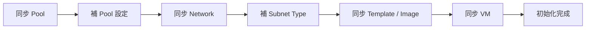

# 12 Cloud Settings 雲端設定

## 1. 功能目的

Cloud Settings 是 HCM 將外部雲端納入管理的入口。管理員在此維護 Cloud Provider、Cloud Connection，並透過初始化同步流程把 provider 端的資源整理成 HCM 標準資料。

此功能的業務目的有四個：

1. 定義 HCM 可管理哪些雲端類型與站點。
2. 建立可連線到 provider 的 connection 與授權資訊。
3. 從 provider 同步 Pool、Subnet、Security Group、VM Catalog、VM。
4. 在同步後補齊 HCM 需要的業務欄位，例如 Pool Site、Region、Allowed Env、Subnet Type。

Cloud Settings 是後續 Apply、Allocation、VM Management、Resource Overview、Project Dimension 的資料來源。

## 2. 使用者與權限

| 角色 | 可進入 | 可操作內容 |
|---|---|---|
| admin | 是 | 管理 Provider、Connection、授權、同步資料、補齊 Pool/Subnet 設定 |
| project_manager | 否 | 不開放 |
| viewer | 否 | 不開放 |
| project viewer | 否 | 不開放 |

此功能屬於平台管理功能，僅 admin 可使用。


## 3. 畫面與 Event 規格

本章依畫面區塊描述，每個區塊包含畫面用途、畫面資料與可操作 event。Provider 差異只描述「此畫面會受 provider 影響」，細節集中在 provider plugin 文件。

### 3.1 Cloud Settings 主畫面

```text
Cloud Settings
┌──────────────────────────────────────────────────────────┐
│ Header                                                   │
│  - 標題                                                  │
│  - 新增 Cloud Provider                                   │
└──────────────────────────────────────────────────────────┘

Provider 區塊
┌──────────────────────────────────────────────────────────┐
│ Provider Header                                          │
│  - Provider 名稱 / 縮寫 / 啟用狀態 / Connection 數        │
│  - 編輯 Provider / 刪除 Provider / 新增 Connection        │
├──────────────────────────────────────────────────────────┤
│ Connection Row                                           │
│  - Connection 名稱、ID、Base URL                         │
│  - 最後同步時間、初始化狀態                              │
│  - 同步資料 / 編輯 / 刪除                                │
└──────────────────────────────────────────────────────────┘
```

主畫面讓 admin 以 Provider 分組管理所有 cloud connection。每個 provider 區塊代表一種雲端類型，每個 connection row 代表一個實際可同步或可操作的 provider 連線。

**畫面資料**

| 資料 | 用途 | 來源 |
|---|---|---|
| Provider ID、名稱、縮寫、顏色 | 分組顯示與辨識 provider | HCM Provider 資料 |
| Provider 啟用狀態 | 決定是否允許新增 connection | HCM Provider 資料 |
| Provider 類型 | 決定 connection 表單與同步流程差異 | HCM Provider 資料 |
| Connection ID、名稱、base URL | 顯示實際連線資訊 | HCM Connection 資料 |
| Connection 同步狀態、最後同步時間 | 顯示初始化與同步狀態 | HCM Connection 資料 |
| Connection 數量 | 顯示 provider 底下已建立幾個連線 | HCM Connection 資料 |

**Event**

| UI 元件 | Event | 業務動作 | 異動/查詢資料 | HCM Backend API | 畫面結果 |
|---|---|---|---|---|---|
| 新增 Cloud Provider | 點擊 | 開啟 provider 設定表單 | 無資料異動，等待使用者輸入 | 無，前端狀態 | 顯示 Provider 表單 |
| 編輯 Provider | 點擊 | 開啟既有 provider 設定 | 查詢 provider 目前設定 | `GET /api/cloud-providers` | 顯示 Provider 表單 |
| 刪除 Provider | 點擊並確認 | 移除 provider 定義 | Provider 資料；需注意既有 connection 數 | `DELETE /api/cloud-providers/:id` | Provider 區塊移除 |
| 新增 Connection | 點擊 | 開啟 connection 表單，預設 provider | 無資料異動，等待使用者輸入 | 無，前端狀態 | 顯示 Connection 表單 |
| 編輯 Connection | 點擊 | 開啟既有 connection 設定 | 查詢 connection 目前設定；敏感資訊以已設定標記呈現 | `GET /api/cloud-connections` | 顯示 Connection 表單 |
| 刪除 Connection | 點擊並確認 | 移除 connection | Connection 資料 | `DELETE /api/cloud-connections/:id` | Connection Row 移除 |
| 同步資料 | 點擊 | 開啟同步資料 Wizard | 查詢 connection、pool、subnet、security group、VM 資料 | `GET /api/cloud-connections` | 顯示同步 Wizard |

### 3.2 Provider 表單

Provider 表單用來定義 HCM 如何呈現與使用某一類雲端。Provider 不代表實際連線，而是 connection 與後續 VM 表單差異的基礎設定。

```text
Provider 表單
┌──────────────────────────────────────────────────────────┐
│ 基本資料                                                  │
│  - Provider 名稱 / 縮寫 / 顏色 / 啟用狀態                 │
│  - Provider 類型                                          │
├──────────────────────────────────────────────────────────┤
│ 站點與環境                                                │
│  - Site / Region / Env                                    │
├──────────────────────────────────────────────────────────┤
│ 業務選項                                                  │
│  - Subnet Type                                            │
│  - VM 表單規則 / 網路策略                                 │
├──────────────────────────────────────────────────────────┤
│ [取消]                                      [儲存]        │
└──────────────────────────────────────────────────────────┘
```

**畫面資料**

| 資料 | 用途 | 來源 |
|---|---|---|
| Provider 名稱、縮寫、顏色 | 主畫面顯示與辨識 | 使用者輸入 |
| Provider 類型 | 決定使用哪一類 provider plugin | 使用者選擇 |
| 啟用狀態 | 控制是否可新增 connection | 使用者輸入 |
| Site / Region / Env 設定 | Pool 補資料與總覽分類 | 使用者輸入 |
| Subnet Type 設定 | Network 同步後補齊 subnet 業務類型 | 使用者輸入 |
| VM 表單規則 | VM Management 顯示哪些 VM 欄位與選項 | 使用者輸入 |

**Event**

| UI 元件 | Event | 業務動作 | 異動/查詢資料 | HCM Backend API | 畫面結果 |
|---|---|---|---|---|---|
| Provider 表單儲存 | 點擊儲存 | 新增或更新 provider 定義 | Provider 資料 | `POST /api/cloud-providers` 或 `PUT /api/cloud-providers/:id` | Provider 區塊更新 |
| Provider 表單取消 | 點擊取消/關閉 | 放棄本次編輯 | 無資料異動 | 無，前端狀態 | 回到主畫面 |

### 3.3 Connection 表單

Connection 表單用來建立或編輯一個實際連到 provider 的連線。表單欄位會依 provider 類型不同而變化。

```text
Connection 表單
┌──────────────────────────────────────────────────────────┐
│ Step 1: 連線設定                                          │
│  - Provider                                               │
│  - Connection 名稱                                        │
│  - Endpoint / Base URL                                    │
│  - 同步範圍 Filter                                        │
│  - TLS 選項                                               │
│  - Auth Type 與授權欄位                                   │
├──────────────────────────────────────────────────────────┤
│ [取消]                         [儲存] 或 [儲存並下一步]   │
└──────────────────────────────────────────────────────────┘
```

**畫面資料**

| 資料 | 用途 | 來源 |
|---|---|---|
| Provider 選項 | 指定 connection 所屬 provider | HCM Provider 資料 |
| Connection 顯示名稱 | 讓 admin 辨識連線 | 使用者輸入 |
| Endpoint / Base URL | 指定實際 provider 連線位置 | 使用者輸入 |
| Pool / VPC / Namespace Filter | 限制同步範圍 | 使用者輸入 |
| TLS Skip Verify | Harvester 等自簽憑證情境 | 使用者輸入 |
| Auth Type | 選擇授權方式 | Provider 能力 |
| Auth 欄位 | 填寫授權所需資料 | 使用者輸入；敏感資訊遮罩 |

**Provider 欄位差異索引**

| Provider 類型 | 主要授權方式 | 畫面欄位差異 | 細節文件 |
|---|---|---|---|
| AWS | Access Key | Access Key ID、Secret Access Key、Region、Session Token | AWS provider 文件 |
| VMware Cloud Director | Basic、Service Account、Token | username/password、client id、tenant、refresh token、device 授權流程 | VCD provider 文件 |
| Harvester | API Token | API Token、Namespace Filter、TLS skip verify | Harvester provider 文件 |
| vSphere | Token | Token、endpoint | vSphere provider 文件 |

**Event**

| UI 元件 | Event | 業務動作 | 異動/查詢資料 | HCM Backend API | 畫面結果 |
|---|---|---|---|---|---|
| Connection 表單儲存 | 點擊儲存 | 建立或更新 provider 連線設定與授權摘要 | Connection 資料；敏感資訊需遵循遮罩規則 | `POST /api/cloud-connections` 或 `PUT /api/cloud-connections/:id` | Connection Row 更新 |
| Connection 表單下一步 | 點擊儲存並下一步，若 provider 需要 | 儲存 provider-specific 授權所需的基本資料並進入授權差異區 | Connection 資料 | `POST /api/cloud-connections` 或 `PUT /api/cloud-connections/:id` | 顯示 Provider 授權差異區 |
| Connection 表單取消 | 點擊取消/關閉 | 放棄本次編輯 | 無資料異動 | 無，前端狀態 | 回到主畫面 |

### 3.4 Provider 授權差異區

Provider 授權不是固定畫面。Cloud Settings 只提供授權流程的共同入口，實際授權欄位、授權步驟與是否需要外部互動，皆由 provider plugin 定義。

此區不是主要流程頁，而是 Connection 表單之後可能出現的 provider-specific 授權延伸區。若 provider 只需要 Basic、Token 或 Access Key，授權會在 Connection 表單完成，不會進入此區；若 provider 需要外部互動授權，才顯示 provider plugin 定義的授權資訊與操作。

```text
Provider 授權差異區
┌──────────────────────────────────────────────────────────┐
│ Provider-specific 授權內容                                │
│  - 需要顯示哪些欄位，由 provider plugin 決定              │
│  - 可能是 user code / verification uri                   │
│  - 也可能沒有此區塊                                      │
│  - 顯示授權狀態 / 授權提示                               │
├──────────────────────────────────────────────────────────┤
│ [provider-specific 授權動作]                 [完成]       │
└──────────────────────────────────────────────────────────┘
```

**授權呈現規則**

| 授權型態 | 是否顯示授權差異區 | 表示方式 | 細節位置 |
|---|---|---|---|
| 表單式授權 | 否 | 在 Connection 表單填寫授權資料，儲存後完成連線資料設定 | 對應 provider 文件的 Auth 與連線設定 |
| 外部互動授權 | 是 | 先儲存 Connection，再依 provider 指示完成外部授權或檢查授權結果 | 對應 provider 文件的 Auth 與連線設定、功能畫面差異 |

**畫面資料**

| 資料 | 用途 | 來源 |
|---|---|---|
| Provider-specific 授權欄位 | 顯示該 provider 需要的額外授權資料 | Provider plugin 定義 |
| 授權提示 | 引導 admin 完成 provider 所需授權步驟 | Provider plugin 定義 |
| 授權狀態 | 顯示授權是否完成或需繼續處理 | HCM Connection / Provider 授權結果 |
| 授權錯誤訊息 | 顯示授權失敗原因摘要 | Provider 授權結果 |

**Event**

| UI 元件 | Event | 業務動作 | 異動/查詢資料 | HCM Backend API | 畫面結果 |
|---|---|---|---|---|---|
| Provider-specific 授權動作 | 點擊 | 依 provider plugin 定義執行授權步驟 | Connection 授權狀態 | `POST /api/cloud-connections/:id/service-account/start` 或 `POST /api/cloud-connections/:id/service-account/poll` | 顯示 provider 定義的授權結果或下一步提示 |
| 検查授權結果 | 點擊，若 provider 需要 | 查詢 provider 授權是否完成 | Connection 授權狀態與授權摘要 | `POST /api/cloud-connections/:id/service-account/poll` | 顯示授權完成、等待中或失敗 |
| 完成 | 點擊 | 結束授權視窗 | 無資料異動 | 無，前端狀態 | 回到主畫面 |

### 3.5 同步資料 Wizard

同步資料 Wizard 是 Cloud Settings 的主要操作流程。它把 provider 資源分成 Pool、Network、Template/Image、VM 四段同步，並要求 admin 在同步後補齊 HCM 業務欄位。

```text
同步資料 Wizard
┌──────────────────────────────────────────────────────────┐
│ Header: Connection 名稱 / Base URL                       │
│ Step Tabs: [1. Pool] [2. Network] [3. Template/Image] [4. VM]
├──────────────────────────────────────────────────────────┤
│ 目前 Step 說明                                            │
│ [執行同步按鈕]                                            │
├──────────────────────────────────────────────────────────┤
│ Step 內容區                                                │
└──────────────────────────────────────────────────────────┘
```

**整體畫面資料**

| 資料 | 用途 | 來源 |
|---|---|---|
| Connection 名稱、base URL | 顯示目前同步目標 | HCM Connection |
| 同步 step | 切換 Pool、Network、Template/Image、VM | HCM 固定流程，provider 可影響顯示名稱 |
| 同步進度 | 顯示同步中、目前處理項目 | Provider 同步結果 |
| 已同步資料數量 | 顯示 Pool、Subnet、Security Group、Template/Image、VM 數量 | HCM 同步後資料 |

#### 3.5.1 Pool Step

Pool Step 用來同步 provider 可管理的資源池與容量，並補齊 HCM 業務欄位。

```text
Pool Step
┌──────────────────────────────────────────────────────────┐
│ 已同步 Pool：N，待補：M                                  │
│ [同步 Pool]                                               │
├──────────────────────────────────────────────────────────┤
│ Pool Card                                                 │
│  - HCM 名稱 / Provider 來源名稱 / Pool ID                 │
│  - Site / Region / Allowed Env                            │
│  - CPU / Memory / Disk                                    │
│  - CPU 換算值（需要時顯示）                               │
│  - 狀態：待補 Pool 設定 / 已設定                           │
├──────────────────────────────────────────────────────────┤
│ [下一步]                                                  │
└──────────────────────────────────────────────────────────┘
```

**畫面資料**

| 資料 | 用途 | 來源 |
|---|---|---|
| 已同步 Pool 數量 | 判斷是否已有 provider 資源進入 HCM | Provider 同步結果 |
| 待補 Pool 清單 | 提醒 admin 補齊必要欄位 | HCM Pool 資料 |
| Pool 名稱與來源名稱 | 顯示 HCM 名稱與 provider 原始名稱 | HCM Pool / Provider 同步結果 |
| Site、Region | 總覽分類與後續管理使用 | HCM Provider Site 設定、admin 補填 |
| Allowed Env | 控制此 pool 可建立哪些環境的 VM | HCM Provider Env 設定、admin 補填 |
| CPU / Memory / Disk 容量 | 顯示與校正資源容量 | Provider 同步結果、admin 補填 |
| CPU MHz/Core 換算值 | VCD / vSphere 類 provider 需要時顯示 | Provider 同步結果優先帶入（VCD 可取 `VCpuInMhz2` 當預設），admin 可再調整 |

**Event**

| UI 元件 | Event | 業務動作 | 異動/查詢資料 | HCM Backend API | 畫面結果 |
|---|---|---|---|---|---|
| 同步 Pool | 點擊 | 從 provider 取得資源池與容量 | 更新 Pool，保留 provider 來源識別 | `POST /api/cloud-connections/:id/sync` (phase: "pools") | Pool 清單更新，未補欄位標示待補 |
| Pool 欄位編輯 | 修改欄位 | 補齊 HCM 使用 Pool 所需業務欄位 | Pool 草稿 | 無，僅使用 HCM 本地資料 | 欄位即時更新 |
| Pool 設定下一步 | 點擊下一步 | 検查並儲存 Pool 的 HCM 業務欄位 | Pool 的名稱、Site、Region、Allowed Env、容量校正 | `PUT /api/pools/:id` | 進入 Network step |

#### 3.5.2 Network Step

Network Step 用來同步 provider 的網路、Subnet 與 Security Group，並補齊 Subnet Type。

```text
Network Step
┌──────────────────────────────────────────────────────────┐
│ 已同步 Subnet：N，待補：M                                │
│ 已同步 Security Group：K                                 │
│ [同步 Network]                                            │
├──────────────────────────────────────────────────────────┤
│ 待補 Subnet Card                                          │
│  - Subnet 名稱 / Pool / CIDR                              │
│  - Subnet Type                                            │
├──────────────────────────────────────────────────────────┤
│ 已同步 Subnet 清單                                        │
│ 已同步 Security Group 清單                                │
├──────────────────────────────────────────────────────────┤
│ [下一步]                                                  │
└──────────────────────────────────────────────────────────┘
```

**畫面資料**

| 資料 | 用途 | 來源 |
|---|---|---|
| 已同步 Subnet 數量 | 顯示網路同步結果 | Provider 同步結果 |
| 待補 Subnet 清單 | 提醒 admin 補齊 Subnet Type | HCM Subnet 資料 |
| Subnet 名稱、CIDR、Gateway | 顯示網路資訊 | Provider 同步結果 |
| Pool 關聯 | 顯示 subnet 可供哪些 pool 使用 | Provider 同步結果 / HCM Pool |
| Subnet Type 選項 | 讓 admin 定義網路用途 | HCM Provider Subnet Type 設定 |
| Security Group 清單 | 顯示 provider 可供 VM 使用的安全群組 | Provider 同步結果 |

**Event**

| UI 元件 | Event | 業務動作 | 異動/查詢資料 | HCM Backend API | 畫面結果 |
|---|---|---|---|---|---|
| 同步 Network | 點擊 | 從 provider 取得網路與安全群組 | 更新 Subnet、Security Group | `POST /api/cloud-connections/:id/sync`（`phase: "network"`） | Subnet / Security Group 清單更新 |
| Subnet Type 編輯 | 選擇類型 | 補齊 HCM 對 subnet 的用途分類 | Subnet 草稿 | `PUT /api/subnets/:id` | Subnet 待補狀態更新 |
| Network 設定下一步 | 點擊下一步 | 檢查並儲存 Subnet Type | Subnet 類型 | `PUT /api/subnets/:id` | 進入 Template/Image step |

#### 3.5.3 Template / Image Step

此 step 用來同步建立 VM 可用的規格來源。不同 provider 可能顯示 Template、Image、Flavor 或其他 catalog 概念。

```text
Template / Image Step
┌──────────────────────────────────────────────────────────┐
│ 已同步 Template/Image：N                                 │
│ [同步 Template/Image]                                     │
├──────────────────────────────────────────────────────────┤
│ Pool Catalog 區塊                                         │
│  - Pool 名稱                                              │
│  - Template / Image 清單                                  │
│  - Latest / Legacy 標記                                   │
│  - Root Device / Storage Class 等摘要                     │
└──────────────────────────────────────────────────────────┘
```

**畫面資料**

| 資料 | 用途 | 來源 |
|---|---|---|
| Template / Image 數量 | 顯示 VM Catalog 同步結果 | Provider 同步結果 |
| Pool 對應的 catalog 清單 | 讓 admin 確認每個 pool 的 VM 建立來源 | Provider 同步結果 |
| Latest / Legacy 標記 | 顯示 image 是否仍為最新同步結果 | HCM VM Catalog |
| Root device / storage class 等摘要 | 顯示建立 VM 可能需要的 provider 屬性 | Provider 同步結果 |

**Event**

| UI 元件 | Event | 業務動作 | 異動/查詢資料 | HCM Backend API | 畫面結果 |
|---|---|---|---|---|---|
| 同步 Template/Image | 點擊 | 從 provider 取得建立 VM 的規格來源 | 更新 Pool VM Catalog | `POST /api/cloud-connections/:id/sync` (phase: "templates") | Template 或 Image 清單更新 |
| 切換 Pool catalog 検視 | 展開或亏覽清單 | 查看某 pool 的 VM 建立選項 | 查詢已同步 VM Catalog | `GET /api/pools` | 顯示對應 Pool 的 catalog |

#### 3.5.4 VM Step

VM Step 用來同步 provider 既有 VM，讓 HCM 後續可在總覽、專案維度與 VM 管理頁呈現現況。

```text
VM Step
┌──────────────────────────────────────────────────────────┐
│ 已同步 VM：N                                             │
│ 建議先完成 Pool / Network / Template/Image 後再同步 VM    │
│ [同步 VM]                                                 │
├──────────────────────────────────────────────────────────┤
│ 同步完成後可回到 Cloud Settings 主畫面                    │
└──────────────────────────────────────────────────────────┘
```

**畫面資料**

| 資料 | 用途 | 來源 |
|---|---|---|
| 已同步 VM 數量 | 顯示 VM 同步結果 | Provider 同步結果 |
| 同步提示 | 提醒 admin 建議在 Pool / Subnet 完成後同步 VM | HCM 固定提示 |

**Event**

| UI 元件 | Event | 業務動作 | 異動/查詢資料 | HCM Backend API | 畫面結果 |
|---|---|---|---|---|---|
| 同步 VM | 點擊 | 從 provider 取得既有 VM 清單與狀態 | 更新 VM 資料與 provider 來源識別 | `POST /api/cloud-connections/:id/sync` (phase: "vms") | VM 數量更新，初始化完成 |
| 關閉 Wizard | 點擊 x | 離開同步流程 | 無資料異動 | 無，前端狀態 | 回到 Cloud Settings 主畫面 |

## 4. 主要業務資料異動流程

### 4.1 建立 Provider 流程

| 步驟 | 使用者目的 | 資料狀態變化 |
|---|---|---|
| 開啟新增 Provider | 建立一個 HCM 可管理的雲端類型 | 尚未異動資料 |
| 填寫 Provider 資訊 | 定義名稱、顏色、provider 類型、站點、Subnet Type、VM 表單規則 | 形成 Provider 草稿 |
| 儲存 Provider | 讓 Cloud Settings 可依 provider 分組，並讓 connection 可選用 | Provider 新增或更新 |

Provider 不代表實際連線；實際連到雲端需建立 Cloud Connection。

### 4.2 建立 Connection 流程

| 步驟 | 使用者目的 | 資料狀態變化 |
|---|---|---|
| 選擇 Provider | 指定此 connection 屬於哪個雲端類型 | Connection 取得 provider 歸屬 |
| 填寫 endpoint / base URL | 指定實際連線位置 | Connection 取得連線位置 |
| 填寫授權資訊 | 讓 HCM 可代表使用者同步或操作 provider | Connection 取得授權摘要；敏感資訊遮罩 |
| 填寫同步範圍 | 限制同步的 VPC、VDC、namespace 或等價範圍 | Connection 取得同步 filter |
| 儲存 | 建立可同步的 connection | Connection 狀態為尚未初始化或待同步 |

### 4.3 Provider 授權流程

Provider 授權由 provider plugin 決定，不在 Cloud Settings 本文寫死某一種方式。Cloud Settings 只定義共同業務語意：建立 connection 時需取得足以同步與操作 provider 的授權資料。

| 型態 | 適用授權方式 | 流程說明 |
|---|---|---|
| 表單式授權 | Basic、Token、Access Key | admin 在 Connection 表單填寫授權資料並儲存；後續同步時由 provider plugin 使用該授權資料連線 |
| 外部互動授權 | Service Account / Device Flow | admin 先儲存 Connection，再啟動外部授權流程，完成後 HCM 更新 connection 授權狀態 |

若 provider 採表單式授權，流程已包含在「建立 Connection 流程」中；若 provider 採外部互動授權，需由 provider 文件補充實際畫面欄位、上行/下行與使用者提示。

| 授權型態 | 使用者目的 | 資料狀態變化 | Provider Plugin |
|---|---|---|---|
| 表單式授權 | 儲存 provider 需要的授權資料 | Connection 可供後續同步使用 | 後續同步時使用 Provider 授權能力 |
| 外部互動授權 | 依 provider 指示完成額外授權 | Connection 授權狀態可能從 pending 變為 authorized 或 error | Provider 授權 |

### 4.4 初始化同步流程



| 階段 | 前置條件 | 完成條件 | 後續影響 |
|---|---|---|---|
| 同步 Pool | Connection 已建立且授權可用 | 至少同步出可管理 Pool；必要欄位可補齊 | Pool 可在總覽、申請、分配、VM 建立中使用 |
| 補 Pool 設定 | Pool 已同步 | Site、Region、Allowed Env 等欄位完整 | Pool 可進入下一階段 |
| 同步 Network | Pool 已可識別 | Subnet / Security Group 同步完成 | VM 建立可選網路 |
| 補 Subnet Type | Subnet 已同步 | Subnet 類型已設定 | Network step 完成 |
| 同步 Template / Image | Pool 已同步 | VM Catalog 寫入 Pool | VM 建立表單可出現規格選項 |
| 同步 VM | Pool / Network / VM Catalog 已處理 | Provider 既有 VM 寫入 HCM | Overview、Project Dimension、VM Management 可看到 VM |

### 4.5 同步資料更新策略

| 資料 | 同步時的業務規則 |
|---|---|
| Pool | 以 provider 來源識別判斷同一資源；已補的 HCM 顯示名稱與業務欄位原則上保留 |
| Subnet | 以 provider network 識別與 connection 判斷同一資源；HCM Subnet Type 可由管理員補 |
| Security Group | 以 provider 安全群組識別判斷同一資源 |
| VM Catalog | 新同步到的 template/image 加入選項；舊選項可標示 legacy |
| VM | 以 provider VM 識別與 pool 關聯判斷同一 VM；狀態與規格依 provider 同步結果更新 |

## 5. Provider Plugin 掛點

| 業務節點 | 觸發畫面/Event | Plugin 能力 | 標準輸入 | 標準輸出 | 對應 plugin 文件 |
|---|---|---|---|---|---|
| Provider 授權 | Connection 表單儲存、Provider-specific 授權動作、檢查授權結果 | Provider 授權 | Connection Auth Input | Auth Result | 對應 provider 文件 |
| 同步資源池 | 同步 Pool | 同步資源池 | Sync Pools Input | Pool Sync Result | 對應 provider 文件 |
| 同步網路 | 同步 Network | 同步網路 | Sync Network Input | Network Sync Result | 對應 provider 文件 |
| 同步 VM 規格來源 | 同步 Template / Image | 同步 VM 規格來源 | Sync VM Catalog Input | VM Catalog Result | 對應 provider 文件 |
| 同步 VM 清單 | 同步 VM | 同步 VM 清單 | Sync VM Inventory Input | VM Inventory Result | 對應 provider 文件 |

Cloud Settings 不負責 VM 建立、VM 開關機；這些 plugin 掛點屬於 VM Management。

## 6. Provider 差異索引

| 畫面/流程位置 | 受影響內容 | 依賴 Provider 能力 | 差異說明文件 |
|---|---|---|---|
| Connection 表單 | 授權方式、endpoint 欄位、filter 欄位、TLS 選項 | Provider 授權 | `provider_plugins/*.md` 的 Auth 與連線設定 |
| Provider 授權差異區 | 是否顯示額外授權區塊、授權欄位、授權提示與動作 | Provider 授權 | 各 provider 文件的 Auth 與連線設定、功能畫面差異 |
| Pool Step | Pool 對應概念、容量欄位、CPU 換算欄位 | 同步資源池 | 各 provider 的資源池轉換與單位換算 |
| Network Step | Subnet 對應概念、Security Group 是否存在 | 同步網路、同步安全群組 | 各 provider 的網路與安全群組轉換 |
| Template/Image Step | 顯示 Template 或 Image，Latest / Legacy 標記 | 同步 VM 規格來源 | 各 provider 的 VM Catalog 轉換 |
| VM Step | VM 狀態、IP、NIC、Disk 欄位完整度 | 同步 VM 清單 | 各 provider 的 VM 欄位轉換 |

## 7. 後續資料流向

| Cloud Settings 產出資料 | 後續使用功能 | 使用目的 |
|---|---|---|
| Provider | Cloud Settings、VM Management | 決定 provider 顯示、connection 建立、VM 表單差異 |
| Connection | Cloud Settings、Provider Plugin | 作為同步與 provider 操作的來源 |
| Pool | Resource Overview、Pool Settings、Apply Wizard、Allocation Management、VM Management | 顯示容量、申請與分配、建立 VM |
| Subnet | Subnet Settings、Pool Settings、VM Management | 管理網路與建立 VM |
| Security Group | VM Management | 建立 VM 時選擇安全群組 |
| VM Catalog | VM Management | 建立 VM 時選擇 template、image、flavor |
| VM | Resource Overview、Project Dimension、VM Management | 顯示既有 VM、狀態與歸屬 |

## 8. 決策紀錄

| 項目 | 決策 |
|---|---|
| Provider 刪除規則 | 允許刪除 Provider，並一併刪除關聯 Connection 與 HCM 資料 |
| Connection 刪除後同步資料處理 | 一併移除 Pool、Subnet、VM 等同步資料 |
| vCD 授權方式 | 保留 Basic、Service Account、Token 三種方式 |
| 同步 Template 與 Image 命名 | 依 Provider 顯示 Template 或 Image |
| CPU MHz/Core 換算值來源與維護 | 優先使用同步 API 回傳值；若未回傳則使用系統預設，且允許人工調整 |
